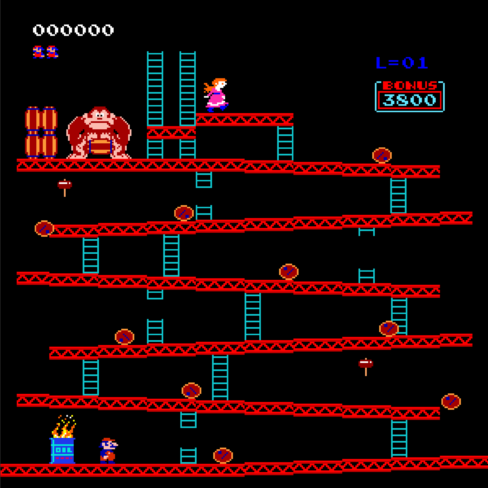
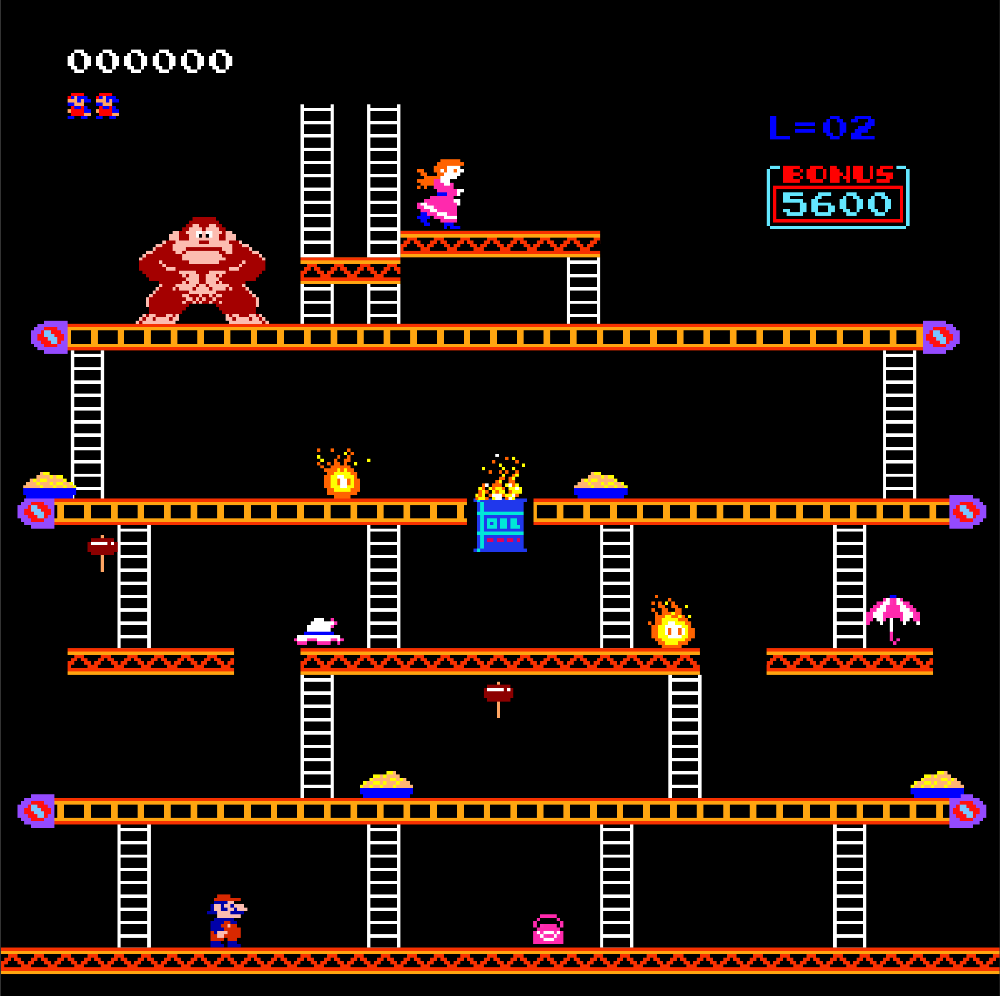
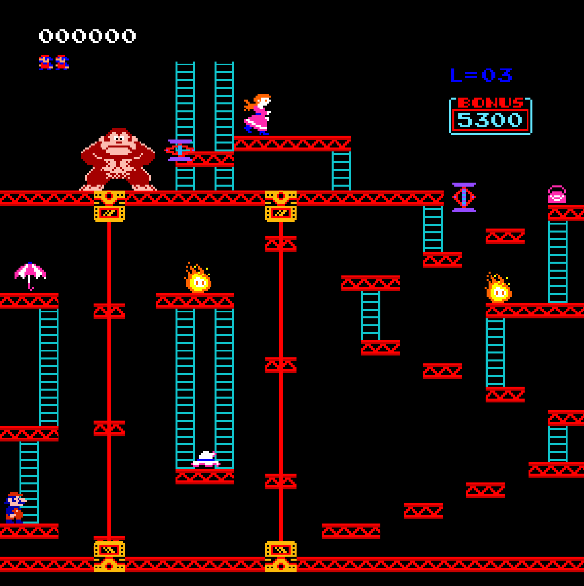
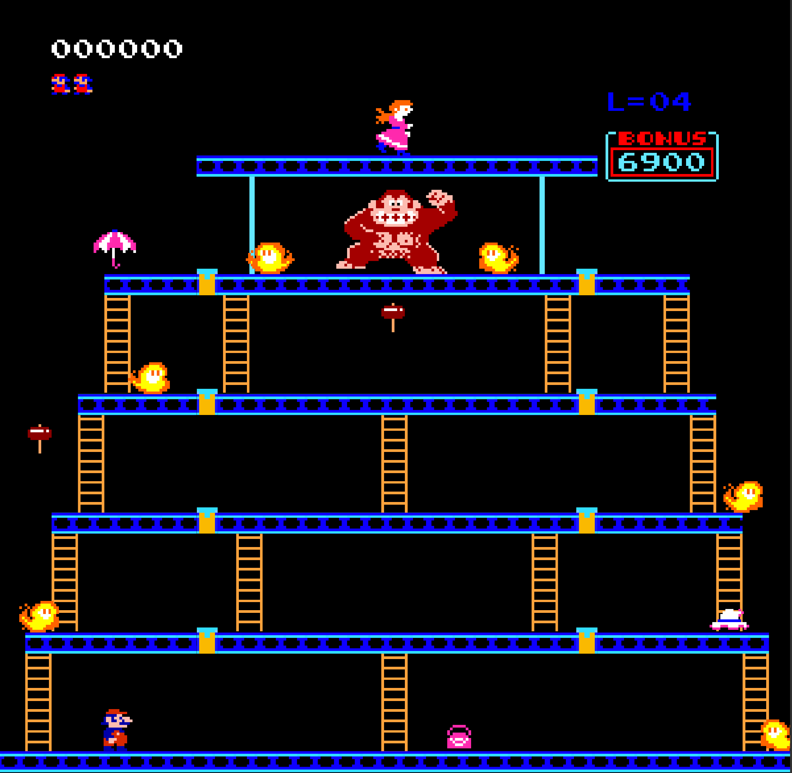

# Donkey Kong 1981 Clone (C + GTK3)

A classic arcade game clone built in C, utilizing the GTK3 toolkit for the GUI and standard POSIX tools for command-line parsing.

## Prerequisites

### Linux (Debian/Ubuntu/Fedora)
Ensure you have the development tools and GTK3 libraries installed:
```bash
# Ubuntu/Debian
sudo apt install build-essential autoconf automake pkg-config libgtk-3-dev
```

### Windows (MSYS2 + MinGW-w64)
1. Install [MSYS2](https://www.msys2.org/).
2. Open the **UCRT64** terminal and install the required packages:
```bash
pacman -Syu
pacman -S base-devel mingw-w64-ucrt-x86_64-gcc mingw-w64-ucrt-x86_64-gtk3 mingw-w64-ucrt-x86_64-pkg-config make autoconf automake
```

## Compilation

This project uses the GNU Autotools build system. Run the following commands from the project root:

1. **Generate the build system:**
   ```bash
   autoreconf -fi
   ```

2. **Configure:**
   ```bash
   ./configure
   ```

3. **Build:**
   ```bash
   make
   ```

The resulting executable will be located in `src/game.exe` (Windows) or `src/game` (Linux).

## Usage

You can launch the game via command line with the following options:

```bash
./src/game [OPTIONS]
```

| Short Flag | Long Flag | Description |
| :--- | :--- | :--- |
| `-h` | `--help` | Show this help message |
| `-x` | `--width=WIDTH` | Set window width (default: 600) |
| `-y` | `--height=HEIGHT` | Set window height (default: 600) |
| `-f` | `--fullscreen` | Start in fullscreen mode |
| `-l` | `--level=LEVEL` | Start at a specific level (1-4) |
| `-p` | `--data-path=DIR` | Set path to game data files |

| Key | Game Controls |
| :--- | :--- |
| `A` | Move character left |
| `D` | Move character right |
| `Space` | Jump |
| `C` | Skip cutscenes |


## Screenshots

| Level 1 | Level 2 |
| :--- | :--- |
|  |  |

| Level 3 | Level 4 |
| :--- | :--- |
|  |  |


## Legal & Academic Notice

### Academic Project
This game was developed as a second-semester project for university. It has been graded and is now presented here for portfolio and educational purposes.

### Copyright Disclaimer
This project is an unofficial, non-commercial fan-made clone of the 1981 "Donkey Kong" arcade game. 
*   **Sprites and Assets:** All original character designs and graphics are the intellectual property of **Nintendo Co., Ltd.**
*   **Intent:** This project is created for educational purposes only and is not intended for commercial release. I hold no claim to the "Donkey Kong" trademark or original intellectual property. 